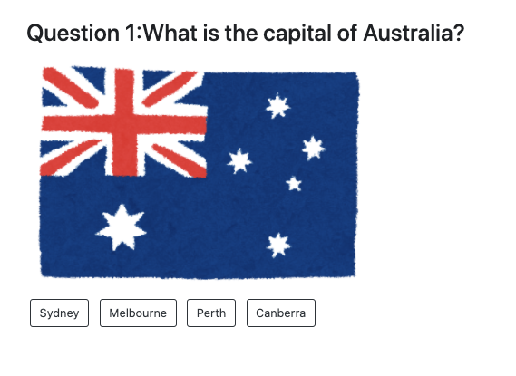
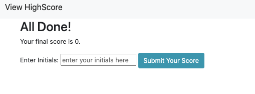

## JavaScript Quiz App

This application is a combination of multiple-choice questions and interactive challenges. I have built a timed code quiz with multiple-choice questions. Once the game starts, the time (which is the score) goes down by 1 point every second. Every time the user gets the incorrect choice, the score decreases by 10. The game is to complete all the questions with higher scores (i.e. less incorrect choices, higher the score.)

This app will run in the browser and feature dynamically updated HTML and CSS powered by JavaScript code. It will also feature a clean and polished user interface and be responsive powered by Bootstrap, ensuring that it adapts to multiple screen sizes.

## Screenshots

Screenshot1) opening

Screenshot2) Once the user clicks the start button, the game starts. 

Screenshot3) At the end of the game, the user gets to submit the final score with his/her initials.

Screenshot4) Highscore gets on the list. 

## Tech used

- HTML
- CSS
- JavaScript
- Bootstrap

## Deployment

https://noriyuki-ishii-820.github.io/JavaScript-Quiz-App/

## User Story

GIVEN I am taking a code quiz
WHEN I click the start button
THEN a timer starts and I am presented with a question
WHEN I answer a question
THEN I am presented with another question
WHEN I answer a question incorrectly
THEN time is subtracted from the clock
WHEN all questions are answered or the timer reaches 0
THEN the game is over
WHEN the game is over
THEN I can save my initials and score

## Licenses
MIT 

## Contact 
send me a message via linkedin: https://www.linkedin.com/in/ishiinoriyuki/
